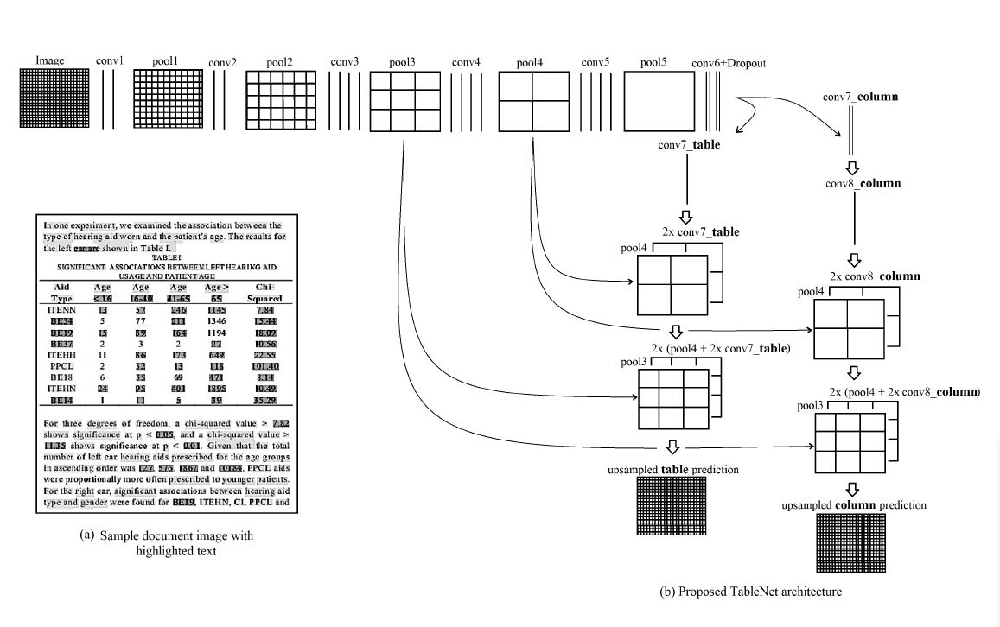
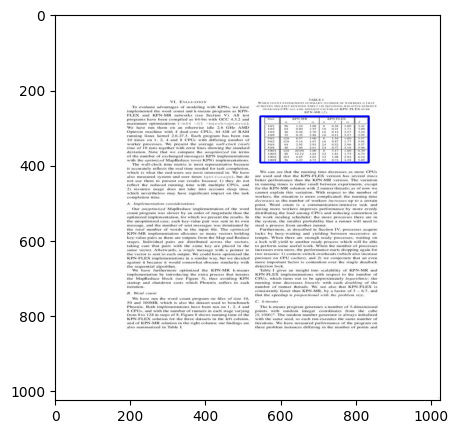
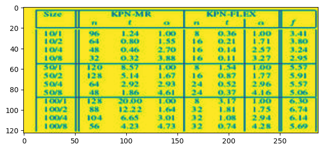
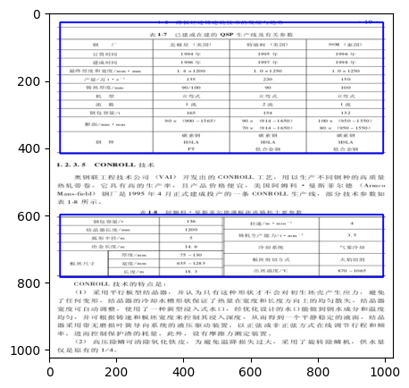
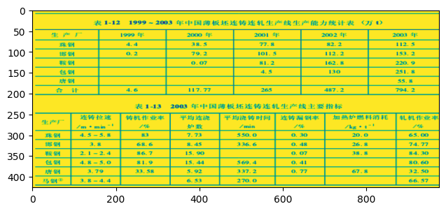
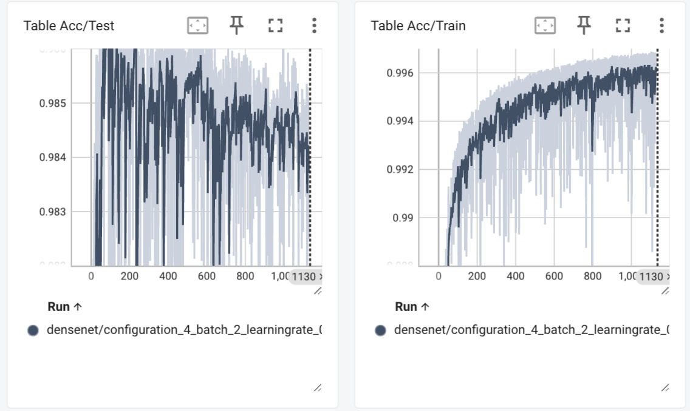
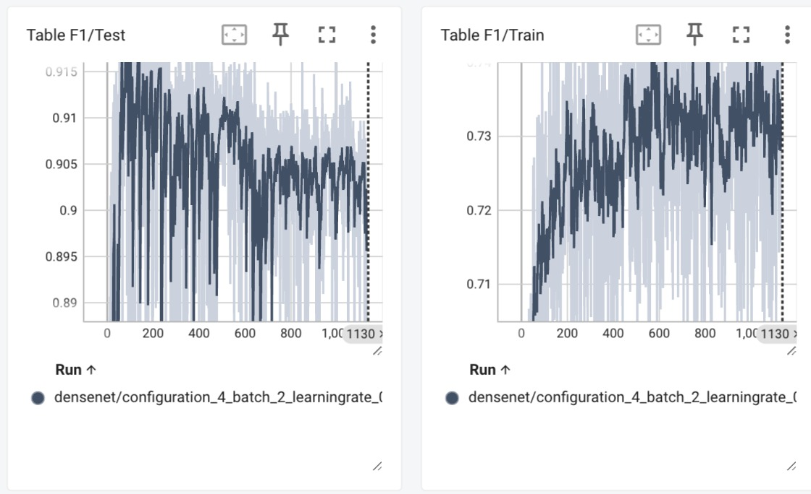
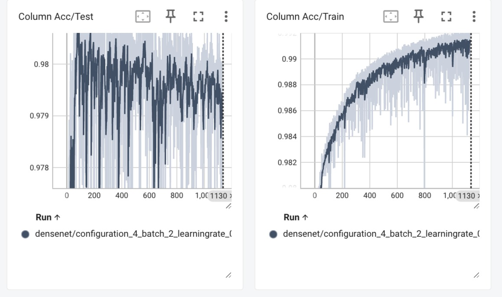
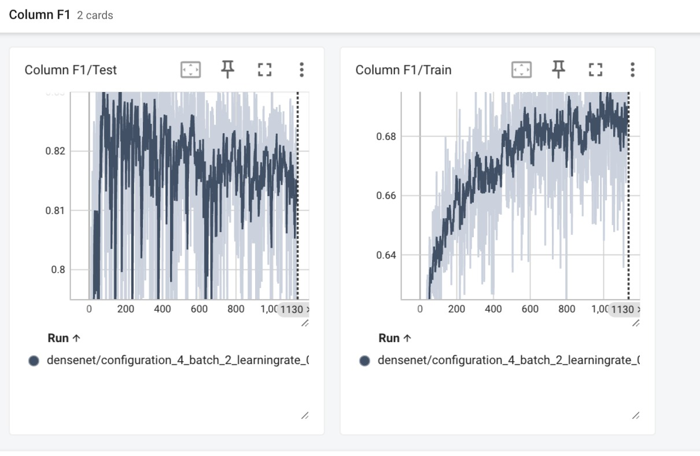

**Implementation of TableNet: Deep Learning model for end-to-end Table detection and Tabular data extraction from Scanned Document Images**

This repo contains the code for TableNet implementation. 

Read the Paper here: [TableNet Paper](https://ieeexplore.ieee.org/document/8978013)

Model Architecture Overview (May change based on the Encoder used):

The Marmot Dataset as well as the Annotated Data can be found here: [Marmot Dataset v1.0](https://www.icst.pku.edu.cn/cpdp/docs/20190424190300041510.zip) ;
[Marmot Extended Dataset by the Authors](https://drive.google.com/drive/folders/1QZiv5RKe3xlOBdTzuTVuYRxixemVIODp)

The Saved Model Checkpoints and the DenseNet121 Pre-trained Weights can be found here:
[TableNet Saved Weights](https://abofi-my.sharepoint.com/:f:/g/personal/somoy_barua_abo_fi/EgFgk_H3uV9Dmo_7eLvYZB4BCaUaKJ1PlFzxcV6OxVYrdA?e=KR9hxd)

Information of the Trained parameters, accuracy and similar things for upto 300 epochs can be found here: [Train Info Text](300.txt)

Unfortunately, due to how heavy the model is, the model has so far been trained only upto 1130 epochs. However, we will upload more rigorously 
trained checkpoints in the future, following a similarly trained model as the original paper. 

We tested the model against ICDAR2019 Table dataset. ICDAR2019 dataset contains 2030 table images with PASCAL VOC format annotations. We picked 34 images and annotated XMLs and then extracted the data and predicted using the trained model weights as was done in the original paper.
More info can be found in the [Test Notebook](Model%20Implementation/model_testing_note.ipynb)
The orignal ground truth labels and boundary boxes from the ICDAR2019 are stored in this CSV : [Ground Truth CSV](ground_truth.csv).

The model predicted boundary boxes on 1130 epochs are stored in this CSV : [Model Prediction 1130 epochs CSV](predicted_1130.csv)

 

Testing image on Marmot Dataset:

 

Testing image on ICDAR Tables:

 

Some keynotes regarding the changes we had to make from the original repo:
- Install required libraries following requirements.txt
    - Some of the libraries no longer exist or are backdated and threw an error.
    - I.e: Sklearn is now scikit-learn
    - Changed requirements.txt file to accommodate the changes in the library name.
    - efficientnet_pytorch - was not mentioned in the requirements.txt however, it is required to run the code.
- Running the Training:
    - Needed to change all the directories within the path_constants.py file to match that of our local drive.
- Running the Tests:
    - Needed to install tesseract OCR in local pc and specify the executable file path in the python code :
        - pytesseract.pytesseract.tesseract_cmd = r'/opt/homebrew/bin/tesseract’
    - PIL -> Image.ANTIALIAS method has been removed from the library after PIL 10.0 update, which is necessary for testing our model. We can now use PIL.Image.Resampling.LANCZOS
- Added additional scripts for testing the model against ICDAR Table dataset.

Training Info (for 1130 Epochs):

Table:

Column:

This repo is inspired from two repos:
[TableNet - Pytorch](https://github.com/asagar60/TableNet-pytorch) And [TableNet2DF](https://github.com/LidorPrototype/TableNetTable2df/tree/master)
